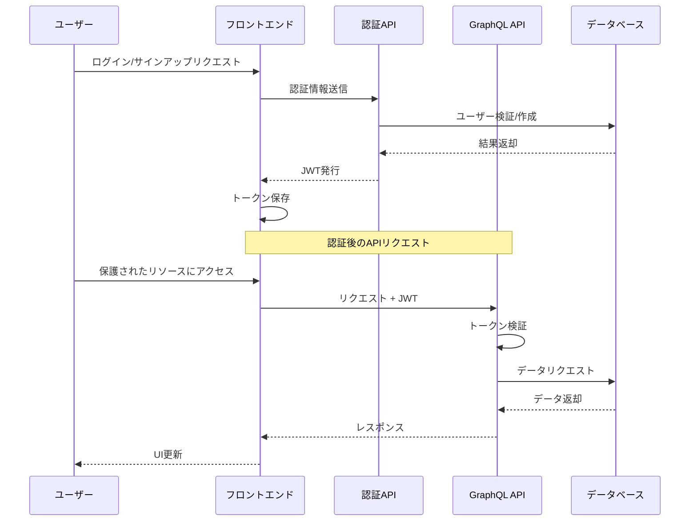
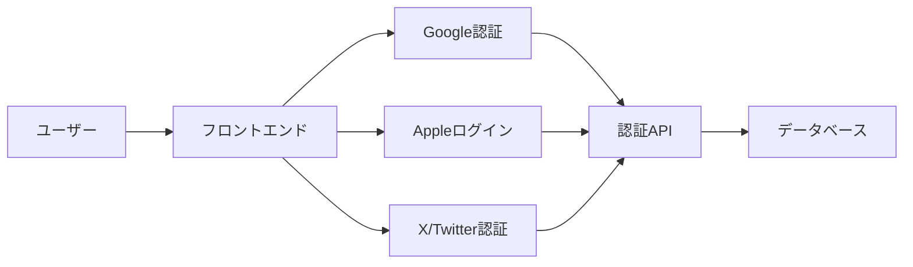

# マチポケ - 認証・認可システム設計

## 概要

マチポケの認証・認可システムは、セキュリティ、ユーザー体験、拡張性のバランスを考慮して設計されています。Cloudflare Workersの特性に最適化された軽量なアプローチを採用し、主にJWT（JSON Web Token）ベースの認証メカニズムを実装しています。

## 認証アーキテクチャ



## 認証方式

### JWT（JSON Web Token）

JWTを使用した認証フローを採用しています：

```typescript
// JWT構造例
interface JWTPayload {
  sub: string;       // ユーザーID
  name: string;      // ユーザー名
  role: string;      // ユーザーロール
  iat: number;       // トークン発行時刻
  exp: number;       // トークン有効期限
  iss: string;       // 発行者
  aud: string;       // 対象者（アプリケーション）
}
```

### 認証フロー実装

```typescript
// 認証ハンドラーの例
export async function authenticateUser(email: string, password: string): Promise<AuthResult> {
  try {
    // ユーザーの検証
    const user = await getUserByEmail(email);
    if (!user) {
      return { success: false, error: 'ユーザーが見つかりません' };
    }

    // パスワード検証
    const isValid = await verifyPassword(password, user.passwordHash);
    if (!isValid) {
      return { success: false, error: 'パスワードが無効です' };
    }

    // JWTの生成
    const token = await generateToken({
      sub: user.id,
      name: user.name,
      role: user.role,
      iat: Math.floor(Date.now() / 1000),
      exp: Math.floor(Date.now() / 1000) + 24 * 60 * 60, // 24時間有効
      iss: 'michishiru-app',
      aud: 'michishiru-api'
    });

    return { 
      success: true, 
      token,
      user: {
        id: user.id,
        name: user.name,
        email: user.email,
        avatarUrl: user.avatarUrl
      }
    };
  } catch (error) {
    return { success: false, error: '認証中にエラーが発生しました' };
  }
}
```

## ソーシャルログイン統合

複数のソーシャルログインプロバイダーをサポートしています：



### OAuth連携実装

```typescript
// ソーシャルログインハンドラーの例
export async function handleSocialLogin(
  provider: 'google' | 'apple' | 'twitter',
  token: string
): Promise<AuthResult> {
  try {
    // トークン検証とユーザー情報取得
    const userData = await verifyProviderToken(provider, token);
    
    // ユーザー存在確認またはユーザー作成
    let user = await getUserByExternalId(provider, userData.id);
    
    if (!user) {
      // 新規ユーザー作成
      user = await createUserFromSocialLogin({
        provider,
        externalId: userData.id,
        email: userData.email,
        name: userData.name,
        avatarUrl: userData.picture
      });
    }
    
    // JWTの生成
    const token = await generateToken({
      sub: user.id,
      name: user.name,
      role: user.role,
      iat: Math.floor(Date.now() / 1000),
      exp: Math.floor(Date.now() / 1000) + 24 * 60 * 60,
      iss: 'michishiru-app',
      aud: 'michishiru-api'
    });
    
    return { 
      success: true, 
      token,
      user: {
        id: user.id,
        name: user.name,
        email: user.email,
        avatarUrl: user.avatarUrl
      }
    };
  } catch (error) {
    return { success: false, error: 'ソーシャルログイン中にエラーが発生しました' };
  }
}
```

## トークン管理

### リフレッシュトークン戦略

長期的なセッション管理のためのリフレッシュトークン実装：

```typescript
// リフレッシュトークンの生成
export async function generateRefreshToken(userId: string): Promise<string> {
  const token = crypto.randomUUID();
  
  // KVに保存（キー: refresh_token:{token}, 値: {userId}）
  await env.KV.put(`refresh_token:${token}`, userId, {
    expirationTtl: 30 * 24 * 60 * 60 // 30日間有効
  });
  
  return token;
}

// アクセストークンのリフレッシュ
export async function refreshAccessToken(refreshToken: string): Promise<AuthResult> {
  try {
    // リフレッシュトークンの検証
    const userId = await env.KV.get(`refresh_token:${refreshToken}`);
    
    if (!userId) {
      return { success: false, error: '無効なリフレッシュトークンです' };
    }
    
    // ユーザー情報の取得
    const user = await getUserById(userId);
    
    if (!user) {
      return { success: false, error: 'ユーザーが見つかりません' };
    }
    
    // 新しいアクセストークンの生成
    const newToken = await generateToken({
      sub: user.id,
      name: user.name,
      role: user.role,
      iat: Math.floor(Date.now() / 1000),
      exp: Math.floor(Date.now() / 1000) + 24 * 60 * 60,
      iss: 'michishiru-app',
      aud: 'michishiru-api'
    });
    
    return { 
      success: true, 
      token: newToken,
      refreshToken, // 同じリフレッシュトークンを返却
      user: {
        id: user.id,
        name: user.name,
        email: user.email,
        avatarUrl: user.avatarUrl
      }
    };
  } catch (error) {
    return { success: false, error: 'トークンのリフレッシュ中にエラーが発生しました' };
  }
}
```

### トークン失効

```typescript
// トークン失効処理
export async function revokeTokens(userId: string): Promise<void> {
  // KVからユーザーのリフレッシュトークンをすべて削除
  const tokens = await env.KV.list({ prefix: `user_refresh_tokens:${userId}:` });
  
  for (const key of tokens.keys) {
    const tokenKey = await env.KV.get(key.name);
    if (tokenKey) {
      await env.KV.delete(`refresh_token:${tokenKey}`);
    }
    await env.KV.delete(key.name);
  }
}
```

## 認可（アクセス制御）

### ロールベースアクセス制御

マチポケでは以下のユーザーロールを定義しています：

1. **ゲスト**: 未認証ユーザー（閲覧のみ）
2. **一般ユーザー**: 認証済みの標準ユーザー
3. **貢献者**: 一定の信頼スコアを持つユーザー
4. **モデレーター**: コンテンツを管理する権限を持つユーザー
5. **管理者**: システム全体を管理する権限を持つユーザー

```typescript
// ロールベースの権限チェック
export function hasPermission(userRole: UserRole, requiredPermission: Permission): boolean {
  const roleHierarchy: Record<UserRole, number> = {
    'guest': 0,
    'user': 1,
    'contributor': 2,
    'moderator': 3,
    'admin': 4
  };
  
  const permissionRequirements: Record<Permission, number> = {
    'spot:read': 0,
    'spot:create': 1,
    'spot:update': 2,
    'spot:delete': 3,
    'user:read': 0,
    'user:update': 1,
    'user:delete': 3,
    'category:read': 0,
    'category:create': 3,
    'category:update': 3,
    'category:delete': 4,
    'comment:create': 1,
    'comment:update': 2,
    'comment:delete': 3
  };
  
  return roleHierarchy[userRole] >= permissionRequirements[requiredPermission];
}
```

### リソースベースのアクセス制御

特定のリソースに対するユーザーのアクセス権を確認します：

```typescript
// スポットの更新権限チェック
export async function canUpdateSpot(userId: string, spotId: string): Promise<boolean> {
  try {
    const user = await getUserById(userId);
    if (!user) return false;
    
    // 管理者またはモデレーターは常に更新可能
    if (user.role === 'admin' || user.role === 'moderator') {
      return true;
    }
    
    // スポットの取得
    const spot = await getSpotById(spotId);
    if (!spot) return false;
    
    // スポット作成者のみ更新可能
    return spot.createdById === userId;
  } catch (error) {
    return false;
  }
}
```

## GraphQL認証ミドルウェア

```typescript
// GraphQLコンテキストで認証情報を提供
export async function createContext({ request }: { request: Request }): Promise<GraphQLContext> {
  // Authorizationヘッダーからトークンを取得
  const authHeader = request.headers.get('Authorization');
  const token = authHeader?.startsWith('Bearer ') ? authHeader.slice(7) : null;
  
  let currentUser = null;
  
  if (token) {
    try {
      // トークンの検証
      const payload = await verifyToken(token);
      
      // ユーザー情報の取得
      currentUser = await getUserById(payload.sub);
    } catch (error) {
      // トークンが無効な場合は何もしない
    }
  }
  
  return {
    currentUser,
    dataSources: {
      spotService: new SpotService(),
      userService: new UserService(),
      // その他のサービス
    }
  };
}

// GraphQLリゾルバでの認証チェック
const resolvers = {
  Mutation: {
    createSpot: async (_, { input }, context) => {
      // 認証チェック
      if (!context.currentUser) {
        throw new AuthenticationError('この操作には認証が必要です');
      }
      
      // 権限チェック
      if (!hasPermission(context.currentUser.role, 'spot:create')) {
        throw new ForbiddenError('スポット作成の権限がありません');
      }
      
      // 処理の実行
      return context.dataSources.spotService.createSpot({
        ...input,
        createdById: context.currentUser.id
      });
    }
  }
};
```

## セキュリティ対策

### CSRF対策

クロスサイトリクエストフォージェリ（CSRF）攻撃からの保護：

```typescript
// CSRFトークンの生成
export function generateCSRFToken(): string {
  return crypto.randomUUID();
}

// CSRFトークン検証ミドルウェア
export function validateCSRFToken(c: Context): Response | void {
  const requestToken = c.req.header('X-CSRF-Token');
  const cookieToken = c.req.cookie('csrf_token');
  
  if (!requestToken || !cookieToken || requestToken !== cookieToken) {
    return c.json({ error: 'CSRFトークンが無効です' }, 403);
  }
}
```

### レート制限

ブルートフォース攻撃からの保護：

```typescript
// レート制限ミドルウェア
export async function rateLimit(c: Context): Promise<Response | void> {
  const ip = c.req.headers.get('CF-Connecting-IP') || 'unknown';
  const endpoint = new URL(c.req.url).pathname;
  const key = `rate_limit:${endpoint}:${ip}`;
  
  // 現在のアクセス数を取得
  const count = parseInt(await env.KV.get(key) || '0', 10);
  
  if (count >= 5) { // 5回/分の制限
    return c.json({ error: 'リクエスト数が多すぎます。時間をおいて再試行してください。' }, 429);
  }
  
  // カウンターを増加
  await env.KV.put(key, (count + 1).toString(), {
    expirationTtl: 60 // 1分間有効
  });
}
```

### パスワードハッシュ化

ユーザーパスワードの安全な保存：

```typescript
// パスワードのハッシュ化（bcrypt互換）
export async function hashPassword(password: string): Promise<string> {
  // WorkerのWebCrypto APIを使用したハッシュ化
  const encoder = new TextEncoder();
  const passwordData = encoder.encode(password);
  
  // ソルトの生成
  const salt = crypto.getRandomValues(new Uint8Array(16));
  
  // パスワードとソルトの結合
  const combined = new Uint8Array(passwordData.length + salt.length);
  combined.set(passwordData);
  combined.set(salt, passwordData.length);
  
  // ハッシュ化
  const hashBuffer = await crypto.subtle.digest('SHA-256', combined);
  const hashArray = Array.from(new Uint8Array(hashBuffer));
  
  // ソルトとハッシュを結合して保存
  const saltHex = Array.from(salt).map(b => b.toString(16).padStart(2, '0')).join('');
  const hashHex = hashArray.map(b => b.toString(16).padStart(2, '0')).join('');
  
  return `${saltHex}:${hashHex}`;
}

// パスワード検証
export async function verifyPassword(password: string, storedHash: string): Promise<boolean> {
  const [saltHex, hashHex] = storedHash.split(':');
  
  // ソルトのデコード
  const salt = new Uint8Array(saltHex.match(/.{1,2}/g)!.map(byte => parseInt(byte, 16)));
  
  // 検証用ハッシュの生成
  const encoder = new TextEncoder();
  const passwordData = encoder.encode(password);
  
  // パスワードとソルトの結合
  const combined = new Uint8Array(passwordData.length + salt.length);
  combined.set(passwordData);
  combined.set(salt, passwordData.length);
  
  // ハッシュ化
  const hashBuffer = await crypto.subtle.digest('SHA-256', combined);
  const hashArray = Array.from(new Uint8Array(hashBuffer));
  const computedHashHex = hashArray.map(b => b.toString(16).padStart(2, '0')).join('');
  
  return computedHashHex === hashHex;
}
```

## デバイス管理

ユーザーデバイスの追跡と管理：

```typescript
// デバイス情報の保存
export async function trackUserDevice(userId: string, deviceInfo: DeviceInfo): Promise<void> {
  const deviceId = crypto.randomUUID();
  
  await env.DB.prepare(`
    INSERT INTO user_devices (id, user_id, device_name, ip_address, user_agent, last_active)
    VALUES (?, ?, ?, ?, ?, ?)
  `)
  .bind(
    deviceId,
    userId,
    deviceInfo.deviceName,
    deviceInfo.ipAddress,
    deviceInfo.userAgent,
    Date.now()
  )
  .run();
  
  // デバイスIDをユーザーのセッションに関連付け
  await env.KV.put(`user_device:${userId}:${deviceId}`, 'active', {
    expirationTtl: 30 * 24 * 60 * 60 // 30日間有効
  });
}

// ユーザーの全デバイスの取得
export async function getUserDevices(userId: string): Promise<UserDevice[]> {
  const { results } = await env.DB.prepare(`
    SELECT id, device_name, ip_address, user_agent, last_active
    FROM user_devices
    WHERE user_id = ?
    ORDER BY last_active DESC
  `)
  .bind(userId)
  .all();
  
  return results.map(device => ({
    id: device.id,
    deviceName: device.device_name,
    ipAddress: device.ip_address,
    userAgent: device.user_agent,
    lastActive: new Date(device.last_active)
  }));
}
```

## フロントエンド認証状態管理

フロントエンドでの認証状態管理と保護されたルート：

```tsx
// 認証コンテキスト
export const AuthContext = createContext<{
  currentUser: User | null;
  isLoading: boolean;
  login: (email: string, password: string) => Promise<boolean>;
  register: (userData: RegisterData) => Promise<boolean>;
  logout: () => void;
  socialLogin: (provider: string, token: string) => Promise<boolean>;
}>({
  currentUser: null,
  isLoading: true,
  login: async () => false,
  register: async () => false,
  logout: () => {},
  socialLogin: async () => false
});

// 認証プロバイダーコンポーネント
export const AuthProvider: React.FC<{ children: React.ReactNode }> = ({ children }) => {
  const [currentUser, setCurrentUser] = useState<User | null>(null);
  const [isLoading, setIsLoading] = useState(true);
  
  // 初期化時に保存されたトークンをチェック
  useEffect(() => {
    const initializeAuth = async () => {
      const token = localStorage.getItem('auth_token');
      if (token) {
        try {
          // トークンの検証とユーザー情報の取得
          const { data } = await client.query({
            query: CURRENT_USER_QUERY,
            context: {
              headers: {
                Authorization: `Bearer ${token}`
              }
            }
          });
          
          setCurrentUser(data.currentUser);
        } catch (error) {
          // トークンが無効な場合はクリア
          localStorage.removeItem('auth_token');
          localStorage.removeItem('refresh_token');
        }
      }
      
      setIsLoading(false);
    };
    
    initializeAuth();
  }, []);
  
  // ログイン処理
  const login = async (email: string, password: string): Promise<boolean> => {
    try {
      const { data } = await client.mutate({
        mutation: LOGIN_MUTATION,
        variables: { email, password }
      });
      
      if (data.login.success) {
        localStorage.setItem('auth_token', data.login.token);
        if (data.login.refreshToken) {
          localStorage.setItem('refresh_token', data.login.refreshToken);
        }
        setCurrentUser(data.login.user);
        return true;
      }
      
      return false;
    } catch (error) {
      return false;
    }
  };
  
  // その他の認証メソッド...
  
  return (
    <AuthContext.Provider value={{
      currentUser,
      isLoading,
      login,
      register,
      logout,
      socialLogin
    }}>
      {children}
    </AuthContext.Provider>
  );
};

// 保護されたルートコンポーネント
export const ProtectedRoute: React.FC<{ children: React.ReactNode }> = ({ children }) => {
  const { currentUser, isLoading } = useContext(AuthContext);
  const location = useLocation();
  
  if (isLoading) {
    return <LoadingSpinner />;
  }
  
  if (!currentUser) {
    return <Navigate to="/login" state={{ from: location }} replace />;
  }
  
  return <>{children}</>;
};
```

## セッション管理

ユーザーセッションの安全な管理：

```typescript
// セッションIDの生成
export function generateSessionId(): string {
  return crypto.randomUUID();
}

// セッションの作成
export async function createSession(userId: string, deviceInfo: DeviceInfo): Promise<string> {
  const sessionId = generateSessionId();
  
  // セッション情報をKVに保存
  await env.KV.put(`session:${sessionId}`, JSON.stringify({
    userId,
    deviceInfo,
    createdAt: Date.now(),
    lastActive: Date.now()
  }), {
    expirationTtl: 24 * 60 * 60 // 24時間有効
  });
  
  // ユーザーのアクティブセッションリストを更新
  await env.KV.put(`user_sessions:${userId}:${sessionId}`, sessionId, {
    expirationTtl: 30 * 24 * 60 * 60 // 30日間有効
  });
  
  return sessionId;
}

// セッションの検証と更新
export async function validateSession(sessionId: string): Promise<User | null> {
  try {
    // セッション情報の取得
    const sessionData = await env.KV.get(`session:${sessionId}`);
    if (!sessionData) return null;
    
    const session = JSON.parse(sessionData);
    
    // セッションの更新
    await env.KV.put(`session:${sessionId}`, JSON.stringify({
      ...session,
      lastActive: Date.now()
    }), {
      expirationTtl: 24 * 60 * 60 // 24時間延長
    });
    
    // ユーザー情報の取得
    const user = await getUserById(session.userId);
    return user;
  } catch (error) {
    return null;
  }
}

// セッションの削除（ログアウト）
export async function destroySession(sessionId: string): Promise<boolean> {
  try {
    // セッション情報の取得
    const sessionData = await env.KV.get(`session:${sessionId}`);
    if (!sessionData) return false;
    
    const session = JSON.parse(sessionData);
    
    // セッションとユーザーセッションリストから削除
    await env.KV.delete(`session:${sessionId}`);
    await env.KV.delete(`user_sessions:${session.userId}:${sessionId}`);
    
    return true;
  } catch (error) {
    return false;
  }
}
```

## 将来的な拡張性

1. **MFA（多要素認証）**:
   - TOTP（Time-based One-Time Password）ベースの2要素認証
   - SMS/メールベースのワンタイムパスワード

2. **OAuth拡張**:
   - 追加のソーシャルログインプロバイダーサポート
   - OAuth 2.0認可サーバーとしての機能

3. **詳細なアクセス制御**:
   - リソースベースの細かな権限設定
   - 動的な権限管理システム

4. **セキュリティ監査**:
   - 不審なログイン試行の検出と通知
   - セキュリティイベントのログ記録と分析