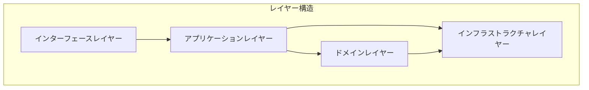
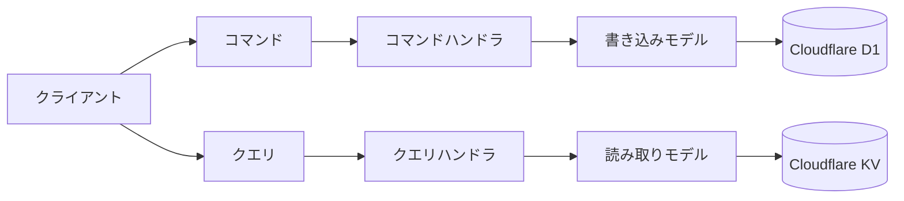
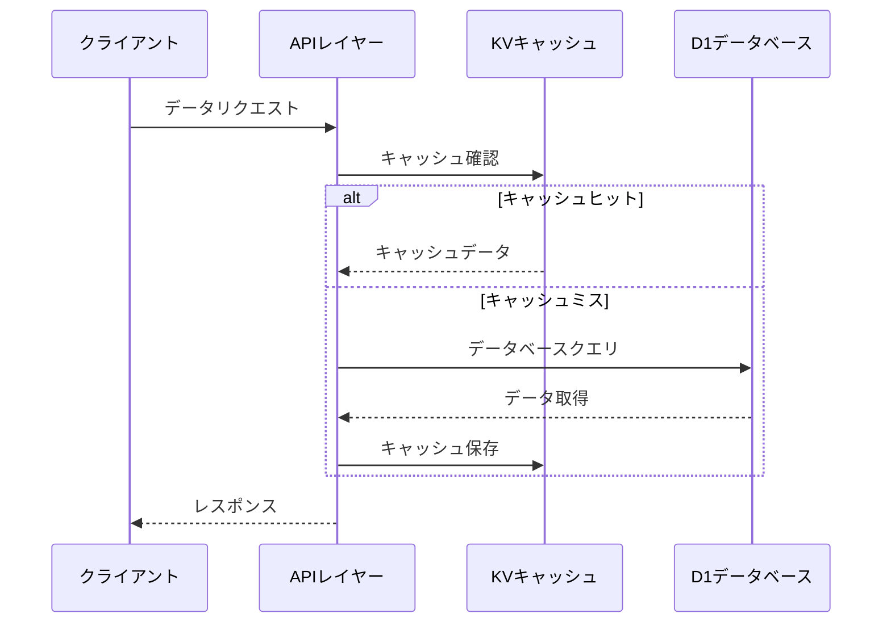
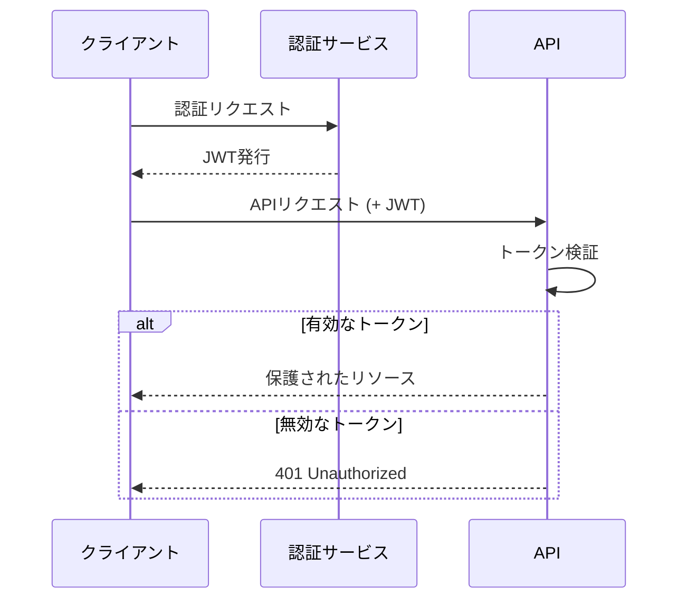
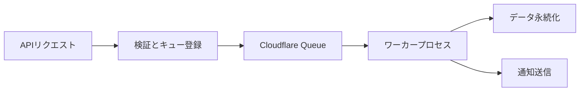
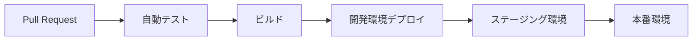

# マチポケ - バックエンドアーキテクチャ

## 概要

マチポケのバックエンドは、Cloudflare Workersをベースとした現代的なサーバーレスアーキテクチャを採用しています。エッジコンピューティングの利点を活かし、世界中のユーザーに低レイテンシーでサービスを提供します。ドメイン駆動設計（DDD）の原則に従い、拡張性と保守性に優れたシステム構造を実現しています。

## 技術スタック

### コア技術
- **Cloudflare Workers**: エッジでの計算実行環境
- **Hono**: 軽量で高速なWebフレームワーク
- **TypeScript**: 型安全なコード開発
- **GraphQL**: 柔軟なAPI設計とクエリ言語
- **Pothos GraphQL**: 型安全なGraphQLスキーマ構築
- **Drizzle ORM**: TypeScript向けSQLクエリビルダー（Cloudflare D1連携）

### データストレージ
- **Cloudflare D1**: SQLiteベースのリレーショナルデータベース（メインデータ）
  - **Drizzle ORM**: D1との連携による型安全なデータアクセス
- **Cloudflare KV**: 高速なキー/バリューストア（キャッシュ、セッション）
- **Cloudflare R2**: S3互換のオブジェクトストレージ（メディアファイル）

### その他のサービス
- **Cloudflare Access / Auth0**: 認証・認可
- **Cloudflare Workers AI**: AI機能（将来的な拡張）
- **Cloudflare Queues**: 非同期タスク処理（将来的な実装）

## アーキテクチャ概念

### ドメイン駆動設計（DDD）の採用

マチポケバックエンドは、DDDの原則に従って以下の4つの主要レイヤーに分かれています：



1. **インターフェースレイヤー**:
   - GraphQLの解決子（リゾルバ）
   - REST APIエンドポイント
   - 入力バリデーション

2. **アプリケーションレイヤー**:
   - ユースケース実装
   - トランザクション制御
   - サービスオーケストレーション

3. **ドメインレイヤー**:
   - エンティティ
   - 値オブジェクト
   - ドメインサービス
   - ドメインイベント

4. **インフラストラクチャレイヤー**:
   - リポジトリ実装
   - 外部APIの統合
   - 永続化とキャッシング

### CQRS (Command Query Responsibility Segregation)

読み取り操作と書き込み操作を分離することで、それぞれを独立して最適化：



- **コマンド（変更操作）**: D1データベースでの永続化
- **クエリ（読み取り操作）**: KVを活用した高速なデータ読み込み

## データアクセス戦略

### リポジトリパターン

ドメインオブジェクトとデータストアの分離：

```typescript
// スキーマ定義例（Drizzle ORM）
import { sqliteTable, text, integer, real } from 'drizzle-orm/sqlite-core';

export const spots = sqliteTable('spots', {
  id: text('id').primaryKey(),
  name: text('name').notNull(),
  description: text('description'),
  latitude: real('latitude').notNull(),
  longitude: real('longitude').notNull(),
  categoryId: text('category_id').notNull(),
  createdById: text('created_by_id').notNull(),
  hiddenGemScore: integer('hidden_gem_score'),
  createdAt: integer('created_at', { mode: 'timestamp' }).notNull()
});

// リポジトリ実装例（Drizzle ORM）
class SpotRepository {
  constructor(private db: D1Database) {}
  
  async findById(id: string): Promise<Spot | null> {
    const drizzle = drizzle(this.db);
    const result = await drizzle
      .select()
      .from(spots)
      .where(eq(spots.id, id))
      .get();
    return result ? this.mapToEntity(result) : null;
  }
  
  async findByLocation(lat: number, lng: number, radius: number): Promise<Spot[]> {
    const drizzle = drizzle(this.db);
    // 地理空間クエリの実装
    const results = await drizzle
      .select()
      .from(spots)
      .where(
        and(
          gte(spots.latitude, lat - radius),
          lte(spots.latitude, lat + radius),
          gte(spots.longitude, lng - radius),
          lte(spots.longitude, lng + radius)
        )
      )
      .all();
    return results.map(this.mapToEntity);
  }
  
  // ...その他のメソッド実装
}
```

### キャッシング戦略

頻繁にアクセスされるデータのパフォーマンス最適化：



## GraphQL API設計

### スキーマ設計 (Pothos GraphQL)

- **コードファースト**: TypeScriptの型から自動生成されるGraphQLスキーマ
- **プラグインシステム**: 機能拡張による柔軟な設計
- **フェデレーション対応**: マイクロサービスとの連携可能性
- **N+1問題の解消**: データローダーによる効率的なデータ取得

```typescript
// Pothos GraphQLによるスキーマ定義例
import { builder } from './builder';
import { spotRepository, categoryRepository, userRepository } from '../repositories';

// 型定義
builder.objectType('Spot', {
  description: '訪問可能なスポット情報',
  fields: (t) => ({
    id: t.exposeID('id'),
    name: t.exposeString('name'),
    description: t.exposeString('description', { nullable: true }),
    latitude: t.exposeFloat('latitude'),
    longitude: t.exposeFloat('longitude'),
    category: t.field({
      type: 'Category',
      resolve: async (spot) => {
        return categoryRepository.findById(spot.categoryId);
      },
    }),
    hiddenGemScore: t.exposeInt('hiddenGemScore', { nullable: true }),
    createdBy: t.field({
      type: 'User',
      resolve: async (spot) => {
        return userRepository.findById(spot.createdById);
      },
    }),
    comments: t.field({
      type: ['Comment'],
      resolve: async (spot) => {
        return commentRepository.findBySpotId(spot.id);
      }
    })
  }),
});

// クエリ定義
builder.queryType({
  fields: (t) => ({
    spot: t.field({
      type: 'Spot',
      nullable: true,
      args: {
        id: t.arg.id({ required: true }),
      },
      resolve: async (_, { id }) => {
        return spotRepository.findById(id);
      },
    }),
    nearbySpots: t.field({
      type: ['Spot'],
      args: {
        lat: t.arg.float({ required: true }),
        lng: t.arg.float({ required: true }),
        radius: t.arg.float({ required: true }),
      },
      resolve: async (_, { lat, lng, radius }) => {
        return spotRepository.findByLocation(lat, lng, radius);
      },
    }),
  }),
});

// ミューテーション定義
builder.mutationType({
  fields: (t) => ({
    createSpot: t.field({
      type: 'Spot',
      args: {
        input: t.arg({ type: CreateSpotInput, required: true }),
      },
      resolve: async (_, { input }, { currentUser }) => {
        // 認可チェック
        if (!currentUser) throw new Error('認証が必要です');
        
        return spotRepository.create({
          ...input,
          createdById: currentUser.id
        });
      },
    }),
    // その他のミューテーション
  }),
});

// スキーマのビルド
export const schema = builder.toSchema();
```

## エラー処理戦略

### 構造化されたエラー応答

一貫性のあるエラーフォーマットで、クライアントが扱いやすいレスポンス：

```typescript
// エラー型
interface AppError {
  code: string;        // エラーコード
  message: string;     // ユーザー向けメッセージ
  details?: unknown;   // 追加情報 (開発者向け)
}

// エラーレスポンス
interface ErrorResponse {
  success: false;
  error: AppError;
}
```

### エラーカテゴリ

- **ValidationError**: 入力データの検証失敗
- **NotFoundError**: リソースが見つからない
- **AuthorizationError**: 権限不足
- **BusinessRuleError**: ビジネスルール違反
- **SystemError**: 内部システムエラー

## 認証・認可

### 認証フロー

Cloudflare AccessまたはAuth0を利用した認証：



### 認可戦略

リソースレベルでの権限管理：

```typescript
// ポリシーベースの認可チェック例
async function canUserModifySpot(userId: string, spotId: string): Promise<boolean> {
  const spot = await spotRepository.findById(spotId);
  if (!spot) return false;
  
  // スポット作成者または管理者は修正可能
  return spot.createdById === userId || await userService.isAdmin(userId);
}
```

## パフォーマンス最適化

### エッジコンピューティングの活用

Cloudflare Workersの世界中のエッジノードを活用したレイテンシー削減：

```
ユーザーリクエスト → 最寄りのエッジノード → レスポンス
```

### クエリ最適化

- **インデックス設計**: 頻繁に使用されるクエリのパフォーマンス向上
- **N+1クエリ問題の解消**: バッチフェッチとDataLoaderパターン
- **クエリ結果のキャッシュ**: 読み取り頻度の高いデータのKVキャッシュ

### 地理空間データの最適化

位置情報検索の効率化：

```sql
-- 空間インデックスと効率的なクエリ例
CREATE INDEX idx_spots_location ON spots(latitude, longitude);

-- 矩形範囲での効率的な検索
SELECT * FROM spots 
WHERE latitude BETWEEN ? AND ?
AND longitude BETWEEN ? AND ?;
```

## スケーラビリティ設計

### 水平スケーリング

Cloudflare Workersの自動スケーリング特性を活用：

- **ステートレス設計**: サーバー間で状態を共有しない
- **分散キャッシュ**: KVを活用した共有キャッシュ

### 非同期処理

長時間実行タスクの分離（将来的な実装）：



## セキュリティ考慮事項

### データ保護

- **転送中の暗号化**: HTTPS通信
- **保存時の暗号化**: 機密データの保護
- **最小限の特権原則**: 必要最小限のデータアクセス

### API保護

- **レート制限**: スロットリングによるDoS攻撃防止
- **入力検証**: すべてのユーザー入力の厳格な検証
- **CORS設定**: 適切なオリジン制限

## 開発と運用

### CI/CD パイプライン



### ロギングとモニタリング

- **構造化ログ**: JSON形式のログ記録
- **エラー追跡**: エラー発生時の自動通知
- **パフォーマンスメトリクス**: レイテンシー、成功率、エラー率の追跡

### デバッグ支援

- **リクエストID**: すべてのリクエストに一意のIDを付与して追跡
- **詳細なエラーコンテキスト**: 開発環境での詳細なエラー情報提供