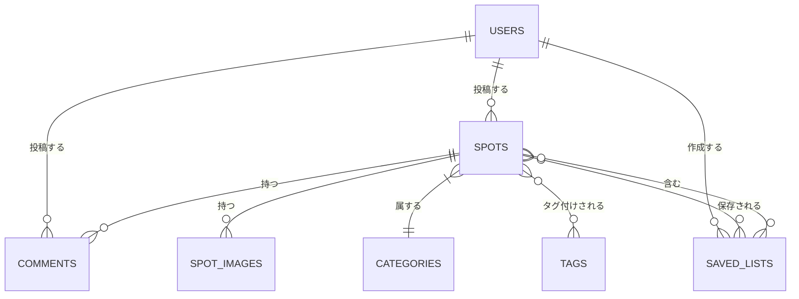

# マチポケ - データモデル設計

## 概要

マチポケのデータモデルは、地元の人だけが知る場所を共有するというサービスの核となる機能をサポートするために設計されています。リレーショナルデータベース（Cloudflare D1）を中心に構成され、ユーザー、スポット、カテゴリ、コメント、保存リストなどの主要エンティティ間の関係を効率的に管理します。

## エンティティ関連図



## データベーススキーマ（Drizzle ORM）

### ユーザー (Users)

```typescript
import { sqliteTable, text, integer } from 'drizzle-orm/sqlite-core';

export const users = sqliteTable('users', {
  id: text('id').primaryKey(), // UUID
  email: text('email').notNull().unique(),
  name: text('name').notNull(),
  avatarUrl: text('avatar_url'),
  bio: text('bio'),
  location: text('location'), // ユーザーの地元/拠点
  expertAreas: text('expert_areas'), // 得意なエリア（カンマ区切り）
  trustScore: integer('trust_score').default(0), // 信頼性スコア
  createdAt: integer('created_at', { mode: 'timestamp' }).notNull(),
  updatedAt: integer('updated_at', { mode: 'timestamp' }).notNull(),
});
```

### スポット (Spots)

```typescript
export const spots = sqliteTable('spots', {
  id: text('id').primaryKey(), // UUID
  name: text('name').notNull(),
  description: text('description'),
  latitude: real('latitude').notNull(),
  longitude: real('longitude').notNull(),
  address: text('address'),
  bestSeason: text('best_season'), // 最適な訪問シーズン
  bestTimeOfDay: text('best_time_of_day'), // 最適な訪問時間帯
  hiddenGemScore: integer('hidden_gem_score'), // 穴場度合い（1-5）
  specialExperience: text('special_experience'), // 特別な体験ができるポイント
  categoryId: text('category_id').notNull()
    .references(() => categories.id),
  createdById: text('created_by_id').notNull()
    .references(() => users.id),
  createdAt: integer('created_at', { mode: 'timestamp' }).notNull(),
  updatedAt: integer('updated_at', { mode: 'timestamp' }).notNull(),
});
```

### カテゴリ (Categories)

```typescript
export const categories = sqliteTable('categories', {
  id: text('id').primaryKey(), // UUID
  name: text('name').notNull(),
  description: text('description'),
  iconName: text('icon_name'), // アイコン名（Material Design Icons等）
  createdAt: integer('created_at', { mode: 'timestamp' }).notNull(),
  updatedAt: integer('updated_at', { mode: 'timestamp' }).notNull(),
});
```

### スポット画像 (SpotImages)

```typescript
export const spotImages = sqliteTable('spot_images', {
  id: text('id').primaryKey(), // UUID
  spotId: text('spot_id').notNull()
    .references(() => spots.id),
  imageUrl: text('image_url').notNull(), // R2ストレージ上のパス
  caption: text('caption'),
  isPrimary: integer('is_primary', { mode: 'boolean' }).default(false),
  createdAt: integer('created_at', { mode: 'timestamp' }).notNull(),
});
```

### コメント (Comments)

```typescript
export const comments = sqliteTable('comments', {
  id: text('id').primaryKey(), // UUID
  spotId: text('spot_id').notNull()
    .references(() => spots.id),
  userId: text('user_id').notNull()
    .references(() => users.id),
  content: text('content').notNull(),
  createdAt: integer('created_at', { mode: 'timestamp' }).notNull(),
  updatedAt: integer('updated_at', { mode: 'timestamp' }).notNull(),
});
```

### タグ (Tags)

```typescript
export const tags = sqliteTable('tags', {
  id: text('id').primaryKey(), // UUID
  name: text('name').notNull().unique(),
  createdAt: integer('created_at', { mode: 'timestamp' }).notNull(),
});
```

### スポットタグ (SpotTags)

```typescript
export const spotTags = sqliteTable('spot_tags', {
  id: text('id').primaryKey(), // UUID
  spotId: text('spot_id').notNull()
    .references(() => spots.id),
  tagId: text('tag_id').notNull()
    .references(() => tags.id),
  createdAt: integer('created_at', { mode: 'timestamp' }).notNull(),
});
```

### 保存リスト (SavedLists)

```typescript
export const savedLists = sqliteTable('saved_lists', {
  id: text('id').primaryKey(), // UUID
  name: text('name').notNull(),
  description: text('description'),
  userId: text('user_id').notNull()
    .references(() => users.id),
  isPublic: integer('is_public', { mode: 'boolean' }).default(false),
  createdAt: integer('created_at', { mode: 'timestamp' }).notNull(),
  updatedAt: integer('updated_at', { mode: 'timestamp' }).notNull(),
});
```

### 保存リストアイテム (SavedListItems)

```typescript
export const savedListItems = sqliteTable('saved_list_items', {
  id: text('id').primaryKey(), // UUID
  listId: text('list_id').notNull()
    .references(() => savedLists.id),
  spotId: text('spot_id').notNull()
    .references(() => spots.id),
  note: text('note'), // ユーザーのプライベートメモ
  visitedAt: integer('visited_at', { mode: 'timestamp' }), // 訪問日
  isVisited: integer('is_visited', { mode: 'boolean' }).default(false),
  createdAt: integer('created_at', { mode: 'timestamp' }).notNull(),
});
```

### ユーザーアクティビティ (UserActivities)

```typescript
export const userActivities = sqliteTable('user_activities', {
  id: text('id').primaryKey(), // UUID
  userId: text('user_id').notNull()
    .references(() => users.id),
  activityType: text('activity_type').notNull(), // 'spot_create', 'spot_visit', 'comment', etc.
  resourceId: text('resource_id'), // 関連リソースID
  resourceType: text('resource_type'), // 'spot', 'comment', etc.
  createdAt: integer('created_at', { mode: 'timestamp' }).notNull(),
});
```

## インデックス設計

効率的なデータアクセスを確保するために、以下のインデックスを設定します：

```typescript
// スポット検索用インデックス
export const spotsGeoIndex = sqliteIndex('idx_spots_geo', spots, {
  columns: [spots.latitude, spots.longitude],
});

export const spotsCategoryIndex = sqliteIndex('idx_spots_category', spots, {
  columns: [spots.categoryId],
});

// コメント検索用インデックス
export const commentsSpotIndex = sqliteIndex('idx_comments_spot', comments, {
  columns: [comments.spotId],
});

// 保存リストアイテム検索用インデックス
export const savedListItemsListIndex = sqliteIndex('idx_saved_list_items_list', savedListItems, {
  columns: [savedListItems.listId],
});

export const savedListItemsSpotIndex = sqliteIndex('idx_saved_list_items_spot', savedListItems, {
  columns: [savedListItems.spotId],
});

// ユーザーアクティビティ検索用インデックス
export const userActivitiesUserIndex = sqliteIndex('idx_user_activities_user', userActivities, {
  columns: [userActivities.userId],
});
```

## リレーションシップと参照整合性

データの整合性を確保するために、以下の参照制約を設定します：

1. **カスケード削除ルール**:
   - ユーザーが削除された場合: 関連するスポット、コメント、保存リストも削除
   - スポットが削除された場合: 関連する画像、コメント、タグ関連付けも削除
   - 保存リストが削除された場合: 関連するリストアイテムも削除

2. **外部キー制約**:
   - スポットは有効なカテゴリを参照しなければならない
   - コメントは有効なスポットとユーザーを参照しなければならない
   - 保存リストアイテムは有効なリストとスポットを参照しなければならない

## データアクセスパターン

主要なデータアクセスパターンに基づいてモデルを最適化しています：

1. **スポット探索**:
   - 地理的位置に基づく近隣スポットの検索
   - カテゴリやタグによるフィルタリング
   - 人気度や穴場度合いによるソート

2. **ユーザープロフィール**:
   - ユーザーが投稿したスポットの表示
   - ユーザーの保存リストの管理
   - ユーザーのアクティビティ履歴の追跡

3. **スポット詳細**:
   - 関連画像と詳細情報の表示
   - コメントスレッドの管理
   - 関連スポットの推奨

## 将来的な拡張性

データモデルは将来的な機能追加を見据えて設計されています：

1. **評価とレビュー**:
   - スポットへの評価システム
   - 詳細なレビュー機能の追加

2. **高度な位置情報**:
   - 経路情報の保存
   - エリア（ポリゴン）の定義と管理

3. **コンテンツモデレーション**:
   - 報告とフラグ立て機能
   - コンテンツ審査ワークフロー

4. **多言語対応**:
   - 翻訳テーブルの追加
   - 地域固有のコンテンツの管理

## Cloudflare KVとの統合

頻繁にアクセスされるデータや高速アクセスが必要なデータは、Cloudflare KVにキャッシュします：

1. **キャッシュキー設計**:
   ```
   spot:{spotId} → スポット詳細情報
   nearby:{lat}:{lng}:{radius} → 近隣スポットのリスト
   user:{userId} → ユーザープロフィール
   category:all → すべてのカテゴリのリスト
   ```

2. **キャッシュ戦略**:
   - 読み取り頻度の高いデータを優先的にキャッシュ
   - 更新時のキャッシュ無効化パターン
   - TTL（Time-to-Live）ベースの有効期限設定

## Cloudflare R2との統合

メディアファイル（画像など）はR2に保存され、以下の命名規則に従います：

```
spots/{spotId}/{imageId}.{extension} → スポット画像
users/{userId}/avatar.{extension} → ユーザーアバター
```

## データバリデーションとビジネスルール

アプリケーションレイヤーで実施される主要なデータバリデーションルール：

1. **スポット作成ルール**:
   - 緯度・経度は有効な範囲内であること
   - 重複スポットの検出と防止（近接した位置の既存スポットをチェック）
   - 必須フィールド（名前、カテゴリ、位置情報）の検証

2. **ユーザー信頼性スコア**:
   - 投稿の質と量に基づいて計算
   - コミュニティからの評価を反映
   - スパム対策メカニズム

## クエリパフォーマンス最適化

D1データベースでのクエリパフォーマンスを最適化するための戦略：

1. **ジオクエリの最適化**:
   ```typescript
   // 効率的な地理空間検索の例
   const nearbySpots = await db
     .select()
     .from(spots)
     .where(
       and(
         between(spots.latitude, lat - radius, lat + radius),
         between(spots.longitude, lng - radius, lng + radius)
       )
     )
     .orderBy(
       sql`((${spots.latitude} - ${lat})*(${spots.latitude} - ${lat}) + 
           (${spots.longitude} - ${lng})*(${spots.longitude} - ${lng}))`
     )
     .limit(20)
     .all();
   ```

2. **ページネーション戦略**:
   ```typescript
   // カーソルベースのページネーション
   const nextSpots = await db
     .select()
     .from(spots)
     .where(
       and(
         eq(spots.categoryId, categoryId),
         gt(spots.id, lastSpotId)
       )
     )
     .orderBy(spots.id)
     .limit(10)
     .all();
   ```

## データ移行と進化戦略

データベーススキーマの進化を管理するためのアプローチ：

1. **マイグレーションフレームワーク**:
   - Drizzle Kitを使用したスキーマ変更の管理
   - 前方互換性のある変更の優先

2. **バージョニング戦略**:
   - 段階的なスキーマ更新
   - データ変換とバックフィルプロセス