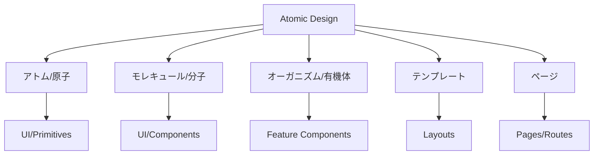
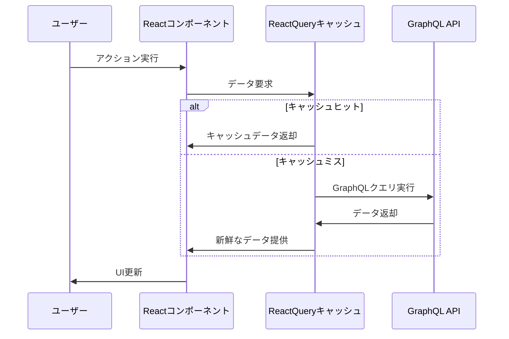

# マチポケ - フロントエンドアーキテクチャ

## 概要

マチポケのフロントエンドは、モダンなReactエコシステムを活用したシングルページアプリケーション（SPA）として設計されており、サーバーサイドレンダリング（SSR）を統合してパフォーマンスとSEOを最適化しています。

## 技術スタック

### コア技術
- **React 18**: UIコンポーネントの構築
- **React Router v7**: 宣言的ルーティング（SSR対応）
- **TypeScript**: 型安全なコード開発
- **Vite**: 高速なビルドとHMR（Hot Module Replacement）

### スタイリング
- **Tailwind CSS**: ユーティリティファーストのCSSフレームワーク
- **shadcn/ui**: Tailwindベースのコンポーネントライブラリ
- **CSS Modules**: コンポーネントスコープのスタイル（必要に応じて）

### 状態管理
- **React Context API**: 軽量な状態共有
- **React Query**: サーバー状態の管理とキャッシング
- **Zustand**: 複雑なクライアント状態の管理（必要に応じて）

### 地図関連
- **Mapbox GL JS** / **Leaflet**: インタラクティブな地図表示
- **GeoJSON**: 地理空間データの処理

### その他の統合
- **GraphQL**: バックエンドとの通信（Apollo Clientを使用）
- **PWA**: オフライン機能とモバイル体験の強化

## アーキテクチャ設計原則

### 1. コンポーネント設計
マチポケのフロントエンドは、以下の原則に基づいたコンポーネント設計を採用しています：



- **Atomic Design**: コンポーネントの再利用性と一貫性を確保
- **機能ベースの分割**: 関連するコンポーネント、フック、ユーティリティを機能ごとにグループ化

### 2. データフェッチング戦略
- **React Query**: キャッシュと再フェッチの最適化
- **GraphQL**: 必要なデータのみを効率的に取得
- **楽観的UI更新**: ユーザー体験向上のため即時UI反映



### 3. レンダリング戦略
- **SSR（サーバーサイドレンダリング）**: 初期ロード時のパフォーマンス向上
- **CSR（クライアントサイドレンダリング）**: インタラクティブな操作後
- **選択的ハイドレーション**: 優先度が高いUIコンポーネントから

## フォルダ構造

```
packages/client/
├── public/             # 静的ファイル
├── src/
│   ├── assets/         # 画像・フォントなどのリソース
│   ├── components/     # 再利用可能なコンポーネント
│   │   ├── ui/         # shadcn/uiベースのプリミティブコンポーネント
│   │   └── common/     # 共通使用のコンポーネント
│   ├── features/       # 機能ごとのコンポーネント
│   │   ├── auth/       # 認証関連
│   │   ├── map/        # 地図表示関連
│   │   ├── spot/       # スポット詳細関連
│   │   └── profile/    # プロフィール関連
│   ├── hooks/          # カスタムReactフック
│   ├── layouts/        # レイアウトコンポーネント
│   ├── lib/            # ユーティリティ関数
│   ├── routes/         # ルーティング設定とページコンポーネント
│   ├── server/         # SSR関連コード
│   ├── store/          # 状態管理
│   ├── styles/         # グローバルスタイル
│   ├── types/          # 型定義
│   ├── graphql/        # GraphQLクエリ/ミューテーション
│   ├── entry-client.tsx # クライアントエントリーポイント
│   └── entry-server.tsx # サーバーエントリーポイント
├── tailwind.config.js  # Tailwind CSS設定
└── vite.config.ts      # Vite設定
```

## パフォーマンス最適化

### 1. コード分割
- **動的インポート**: ルーティングベースのコード分割
- **レイジーローディング**: 初期表示に必要ないコンポーネントの遅延ロード

### 2. 画像最適化
- **WebP/AVIF**: 最新フォーマットの使用
- **レスポンシブ画像**: 画面サイズに応じたサイズ最適化
- **レイジーローディング**: ビューポート内に入ったときのみロード

### 3. キャッシング戦略
- **ブラウザキャッシュ**: 静的アセットの効率的な配信
- **React Query**: データキャッシュの管理
- **Service Worker**: オフライン体験の向上

## アクセシビリティ（A11y）

マチポケは、WCAG（Web Content Accessibility Guidelines）に準拠するよう設計され、以下の点に注意を払っています：

- **セマンティックHTML**: 適切なタグの使用
- **キーボードナビゲーション**: すべての機能がキーボードで操作可能
- **スクリーンリーダー対応**: 適切なARIAラベルの使用
- **十分なコントラスト**: テキストと背景のコントラスト比の確保
- **レスポンシブデザイン**: あらゆる画面サイズでの使いやすさ

## インターナショナリゼーション（i18n）と地域化（l10n）

将来的な多言語対応を見据え、以下の設計を実装：

- **React-Intl**: メッセージの翻訳管理
- **分離されたメッセージファイル**: 言語ごとのリソースバンドル
- **RTL（右から左）サポート**: アラビア語などの言語対応

## テスト戦略

- **Jest**: ユニットテストとスナップショットテスト
- **React Testing Library**: コンポーネントの振る舞いテスト
- **Cypress**: エンドツーエンドテスト
- **Storybook**: コンポーネントの視覚的テストとドキュメント化

## PWA機能

- **Service Worker**: オフラインキャッシングと背景同期
- **マニフェストファイル**: ホーム画面インストール設定
- **プッシュ通知**: ユーザーエンゲージメント向上（将来的実装）

## セキュリティ考慮事項

- **CSP（Content Security Policy）**: XSS攻撃の防止
- **HTTPS強制**: 安全な通信の確保
- **適切なCORS設定**: クロスオリジンリクエストの制御
- **サードパーティライブラリの監査**: 既知の脆弱性のチェック

## 開発ワークフロー

- **ESLint + Prettier**: コード品質とフォーマット
- **Husky**: コミット前のリントとテスト
- **TypeScript厳格モード**: 型安全性の確保
- **Conventional Commits**: 標準化されたコミットメッセージ