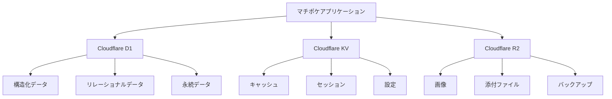
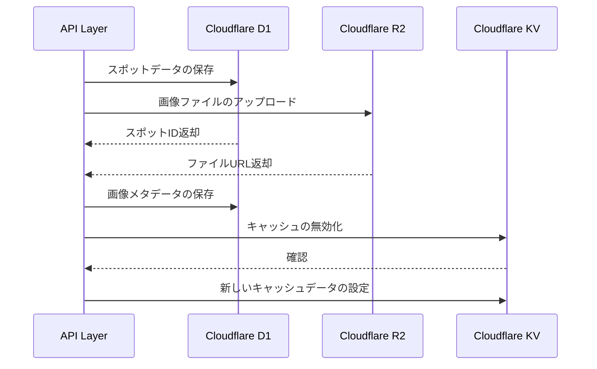

# マチポケ - ストレージ設計

## 概要

マチポケは、Cloudflareのストレージサービスを最大限に活用して、スケーラブルで信頼性の高いデータ管理を実現しています。主に以下の3つのストレージサービスを目的に応じて使い分けています：

1. **Cloudflare D1**: リレーショナルデータベースとしてアプリケーションの永続データを管理
2. **Cloudflare KV**: 高速なキー/バリューストアとしてキャッシュやセッションデータを格納
3. **Cloudflare R2**: S3互換のオブジェクトストレージとして画像などのメディアファイルを保存



## Cloudflare D1: リレーショナルデータベース

### 用途

D1は、SQLiteベースのリレーショナルデータベースであり、マチポケの構造化データを管理するために使用します：

- ユーザープロファイル
- スポット情報
- コメント
- カテゴリとタグ
- 保存リスト
- 関連付けや参照関係

### 設定と接続

```typescript
// wrangler.toml
export interface Env {
  DB: D1Database;
  // その他の環境変数
}

// D1データベース接続の設定例
export default {
  async fetch(request: Request, env: Env, ctx: ExecutionContext): Promise<Response> {
    const app = new Hono<{ Bindings: Env }>();
    
    // アプリケーションの設定
    
    return app.fetch(request, env, ctx);
  }
};
```

### Drizzle ORMでのデータアクセス

```typescript
import { drizzle } from 'drizzle-orm/d1';
import { eq, and, or, like } from 'drizzle-orm';
import * as schema from '../db/schema';

// リポジトリパターンでのD1アクセス例
export class SpotRepository {
  private db: ReturnType<typeof drizzle>;
  
  constructor(d1: D1Database) {
    this.db = drizzle(d1, { schema });
  }
  
  async findById(id: string): Promise<Spot | null> {
    const results = await this.db.select()
      .from(schema.spots)
      .where(eq(schema.spots.id, id))
      .get();
    
    return results ? this.mapToEntity(results) : null;
  }
  
  async create(data: NewSpotData): Promise<Spot> {
    const id = crypto.randomUUID();
    const now = Math.floor(Date.now() / 1000);
    
    await this.db.insert(schema.spots)
      .values({
        id,
        name: data.name,
        description: data.description || null,
        latitude: data.latitude,
        longitude: data.longitude,
        categoryId: data.categoryId,
        createdById: data.createdById,
        hiddenGemScore: data.hiddenGemScore || null,
        createdAt: now,
        updatedAt: now
      });
    
    return this.findById(id) as Promise<Spot>;
  }
  
  async findNearby(
    lat: number, 
    lng: number, 
    radius: number = 5, 
    limit: number = 20
  ): Promise<Spot[]> {
    // 簡易的な地理空間検索
    // 緯度1度は約111km、経度1度は赤道で約111km（極に近づくほど小さくなる）
    // 与えられたradiusをkm単位で計算
    const latDelta = radius / 111;
    const lngDelta = radius / (111 * Math.cos(lat * (Math.PI / 180)));
    
    const results = await this.db.select()
      .from(schema.spots)
      .where(
        and(
          gte(schema.spots.latitude, lat - latDelta),
          lte(schema.spots.latitude, lat + latDelta),
          gte(schema.spots.longitude, lng - lngDelta),
          lte(schema.spots.longitude, lng + lngDelta)
        )
      )
      .limit(limit)
      .all();
    
    return results.map(this.mapToEntity);
  }
  
  // その他のメソッド
}
```

### 移行管理

D1データベースのスキーマ変更管理：

```typescript
// drizzle.config.ts
import type { Config } from 'drizzle-kit';

export default {
  schema: './src/db/schema.ts',
  out: './migrations',
  driver: 'd1',
  dbCredentials: {
    wranglerConfigPath: './wrangler.toml',
    dbName: 'michishiru_db',
  },
} satisfies Config;
```

移行スクリプトの実行：

```bash
# マイグレーションファイルの生成
npx drizzle-kit generate

# マイグレーションの適用
npx wrangler d1 migrations apply michishiru_db
```

### パフォーマンス最適化

1. **インデックス**: よく使用されるクエリにインデックスを作成

```typescript
// スポット地理検索用インデックス
export const spotsGeoIndex = sqliteIndex('idx_spots_geo', spots, {
  columns: [spots.latitude, spots.longitude],
});

// カテゴリ検索用インデックス
export const spotsCategoryIndex = sqliteIndex('idx_spots_category', spots, {
  columns: [spots.categoryId],
});
```

2. **トランザクション処理**: データ整合性を確保

```typescript
// トランザクション内での複数操作
async createSpotWithImages(data: NewSpotData, images: ImageData[]): Promise<Spot> {
  return await this.db.transaction(async (tx) => {
    // スポットの作成
    const spotId = crypto.randomUUID();
    const now = Math.floor(Date.now() / 1000);
    
    await tx.insert(schema.spots).values({
      id: spotId,
      // 他のフィールド
    });
    
    // 画像の登録
    for (const image of images) {
      await tx.insert(schema.spotImages).values({
        id: crypto.randomUUID(),
        spotId,
        imageUrl: image.url,
        caption: image.caption,
        isPrimary: image.isPrimary ? 1 : 0,
        createdAt: now
      });
    }
    
    // 作成したスポットの取得
    const spot = await tx.select()
      .from(schema.spots)
      .where(eq(schema.spots.id, spotId))
      .get();
    
    return this.mapToEntity(spot);
  });
}
```

## Cloudflare KV: キー/バリューストア

### 用途

KVは、高速なキー/バリューストレージとして以下の用途に使用します：

- API応答のキャッシュ
- ユーザーセッション
- アクセストークンと認証情報
- 設定データ
- カウンターやレート制限

### 設定と接続

```typescript
// wrangler.toml
export interface Env {
  KV: KVNamespace;
  // その他の環境変数
}

// KVアクセスの設定例
export default {
  async fetch(request: Request, env: Env, ctx: ExecutionContext): Promise<Response> {
    const app = new Hono<{ Bindings: Env }>();
    
    // アプリケーションの設定
    
    return app.fetch(request, env, ctx);
  }
};
```

### キャッシュ戦略

```typescript
// KVベースのキャッシュサービス
export class CacheService {
  constructor(private kv: KVNamespace) {}
  
  // データの取得（キャッシュヒットまたはデータベースから取得）
  async getOrFetch<T>(
    key: string,
    fetcher: () => Promise<T>,
    ttl: number = 3600 // デフォルト1時間
  ): Promise<T> {
    // キャッシュチェック
    const cached = await this.kv.get<T>(key, { type: 'json' });
    
    if (cached !== null) {
      return cached;
    }
    
    // データベースから取得
    const data = await fetcher();
    
    // キャッシュに保存
    await this.kv.put(key, JSON.stringify(data), { expirationTtl: ttl });
    
    return data;
  }
  
  // キャッシュの無効化
  async invalidate(key: string): Promise<void> {
    await this.kv.delete(key);
  }
  
  // パターンに基づくキャッシュの無効化
  async invalidatePattern(pattern: string): Promise<void> {
    const keys = await this.kv.list({ prefix: pattern });
    
    const promises = keys.keys.map(key => this.kv.delete(key.name));
    await Promise.all(promises);
  }
}
```

### セッション管理

```typescript
// KVベースのセッション管理
export class SessionService {
  constructor(private kv: KVNamespace) {}
  
  // セッションの作成
  async createSession(userId: string, metadata: SessionMetadata = {}): Promise<string> {
    const sessionId = crypto.randomUUID();
    const session = {
      userId,
      createdAt: Date.now(),
      lastActive: Date.now(),
      ...metadata
    };
    
    // セッションの保存
    await this.kv.put(
      `session:${sessionId}`,
      JSON.stringify(session),
      { expirationTtl: 24 * 60 * 60 } // 24時間有効
    );
    
    // ユーザーとセッションの関連付け
    await this.kv.put(
      `user_session:${userId}:${sessionId}`,
      sessionId,
      { expirationTtl: 30 * 24 * 60 * 60 } // 30日間有効
    );
    
    return sessionId;
  }
  
  // セッションの取得と更新
  async getSession(sessionId: string): Promise<Session | null> {
    const data = await this.kv.get(`session:${sessionId}`);
    
    if (!data) {
      return null;
    }
    
    const session = JSON.parse(data) as Session;
    
    // 最終アクティブ時間の更新
    session.lastActive = Date.now();
    await this.kv.put(
      `session:${sessionId}`,
      JSON.stringify(session),
      { expirationTtl: 24 * 60 * 60 } // 有効期限を24時間延長
    );
    
    return session;
  }
  
  // セッションの削除
  async deleteSession(sessionId: string): Promise<void> {
    const data = await this.kv.get(`session:${sessionId}`);
    
    if (data) {
      const session = JSON.parse(data) as Session;
      await this.kv.delete(`session:${sessionId}`);
      await this.kv.delete(`user_session:${session.userId}:${sessionId}`);
    }
  }
  
  // ユーザーのすべてのセッションを削除
  async deleteUserSessions(userId: string): Promise<void> {
    const sessions = await this.kv.list({ prefix: `user_session:${userId}:` });
    
    const deletePromises = sessions.keys.map(async key => {
      const sessionId = await this.kv.get(key.name);
      if (sessionId) {
        await this.kv.delete(`session:${sessionId}`);
      }
      await this.kv.delete(key.name);
    });
    
    await Promise.all(deletePromises);
  }
}
```

### レート制限

```typescript
// KVベースのレート制限
export class RateLimiter {
  constructor(private kv: KVNamespace) {}
  
  // リクエストのカウント
  async increment(
    key: string,
    limit: number = 60,
    window: number = 60 // デフォルト1分
  ): Promise<{
    success: boolean;
    current: number;
    remaining: number;
    reset: number;
  }> {
    const now = Math.floor(Date.now() / 1000);
    const windowKey = `${key}:${Math.floor(now / window)}`;
    
    // 現在のカウントを取得
    const currentValue = await this.kv.get(windowKey);
    const current = currentValue ? parseInt(currentValue) : 0;
    
    // 上限チェック
    if (current >= limit) {
      return {
        success: false,
        current,
        remaining: 0,
        reset: (Math.floor(now / window) + 1) * window
      };
    }
    
    // カウンターを増加
    const newValue = current + 1;
    await this.kv.put(windowKey, newValue.toString(), {
      expirationTtl: window * 2 // 少し余裕を持たせる
    });
    
    return {
      success: true,
      current: newValue,
      remaining: limit - newValue,
      reset: (Math.floor(now / window) + 1) * window
    };
  }
}
```

## Cloudflare R2: オブジェクトストレージ

### 用途

R2は、S3互換のオブジェクトストレージとして以下の用途に使用します：

- スポット画像の保存
- ユーザーアバター画像
- 添付ファイル
- バックアップデータ

### 設定と接続

```typescript
// wrangler.toml
export interface Env {
  R2: R2Bucket;
  // その他の環境変数
}

// R2アクセスの設定例
export default {
  async fetch(request: Request, env: Env, ctx: ExecutionContext): Promise<Response> {
    const app = new Hono<{ Bindings: Env }>();
    
    // アプリケーションの設定
    
    return app.fetch(request, env, ctx);
  }
};
```

### ファイルの保存と取得

```typescript
// R2ストレージサービス
export class StorageService {
  constructor(private bucket: R2Bucket) {}
  
  // ファイルのアップロード
  async uploadFile(
    key: string,
    data: ArrayBuffer | Uint8Array | ReadableStream,
    metadata: Record<string, string> = {},
    contentType?: string
  ): Promise<string> {
    const options: R2PutOptions = {
      httpMetadata: contentType ? { contentType } : undefined,
      customMetadata: metadata
    };
    
    await this.bucket.put(key, data, options);
    
    // 公開アクセス用URLの生成
    return `https://storage.michishiru.example.com/${key}`;
  }
  
  // ファイルの取得
  async getFile(key: string): Promise<R2ObjectBody | null> {
    const object = await this.bucket.get(key);
    return object;
  }
  
  // ファイルの削除
  async deleteFile(key: string): Promise<void> {
    await this.bucket.delete(key);
  }
  
  // 複数ファイルの削除
  async deleteFiles(keys: string[]): Promise<void> {
    await this.bucket.delete(keys);
  }
  
  // ディレクトリの全ファイルを削除
  async deleteDirectory(prefix: string): Promise<void> {
    const objects = await this.bucket.list({ prefix });
    if (objects.objects.length > 0) {
      const keys = objects.objects.map(object => object.key);
      await this.bucket.delete(keys);
    }
  }
}
```

### 画像アップロードワークフロー

```typescript
// 画像アップロードとリサイズ処理
export class ImageService {
  constructor(
    private storage: StorageService,
    private db: D1Database
  ) {}
  
  // スポット画像のアップロード
  async uploadSpotImage(
    spotId: string,
    file: File,
    caption: string = '',
    isPrimary: boolean = false
  ): Promise<SpotImage> {
    const imageId = crypto.randomUUID();
    const fileExt = this.getFileExtension(file.name);
    const key = `spots/${spotId}/${imageId}.${fileExt}`;
    
    // 画像メタデータ
    const metadata = {
      spotId,
      imageId,
      originalName: file.name,
      caption,
      isPrimary: isPrimary.toString()
    };
    
    // ファイルのアップロード
    const url = await this.storage.uploadFile(
      key,
      await file.arrayBuffer(),
      metadata,
      file.type
    );
    
    // データベースに画像情報を保存
    const drizzle = drizzle(this.db);
    await drizzle.insert(schema.spotImages).values({
      id: imageId,
      spotId,
      imageUrl: url,
      caption,
      isPrimary: isPrimary ? 1 : 0,
      createdAt: Math.floor(Date.now() / 1000)
    });
    
    return {
      id: imageId,
      spotId,
      imageUrl: url,
      caption,
      isPrimary,
      createdAt: new Date()
    };
  }
  
  // ユーザーアバター画像のアップロード
  async uploadUserAvatar(
    userId: string,
    file: File
  ): Promise<string> {
    const fileExt = this.getFileExtension(file.name);
    const key = `users/${userId}/avatar.${fileExt}`;
    
    // 画像メタデータ
    const metadata = {
      userId,
      originalName: file.name,
      uploadedAt: new Date().toISOString()
    };
    
    // ファイルのアップロード
    const url = await this.storage.uploadFile(
      key,
      await file.arrayBuffer(),
      metadata,
      file.type
    );
    
    // ユーザープロフィールのアバターURLを更新
    const drizzle = drizzle(this.db);
    await drizzle.update(schema.users)
      .set({ avatarUrl: url, updatedAt: Math.floor(Date.now() / 1000) })
      .where(eq(schema.users.id, userId));
    
    return url;
  }
  
  // ファイル拡張子の取得
  private getFileExtension(filename: string): string {
    return filename.split('.').pop()?.toLowerCase() || 'dat';
  }
}
```

### 画像の提供と最適化

```typescript
// 画像配信ハンドラー
export async function handleImageRequest(request: Request, env: Env): Promise<Response> {
  const url = new URL(request.url);
  const path = url.pathname.replace(/^\\/images\\//, '');
  
  // パラメータの解析
  const width = url.searchParams.get('w') ? parseInt(url.searchParams.get('w')!) : undefined;
  const height = url.searchParams.get('h') ? parseInt(url.searchParams.get('h')!) : undefined;
  const format = url.searchParams.get('format');
  const quality = url.searchParams.get('q') ? parseInt(url.searchParams.get('q')!) : undefined;
  
  // R2からオブジェクトを取得
  const object = await env.R2.get(path);
  
  if (!object) {
    return new Response('Image not found', { status: 404 });
  }
  
  // 画像変換が不要な場合はそのまま返す
  if (!width && !height && !format && !quality) {
    const headers = new Headers();
    object.writeHttpMetadata(headers);
    headers.set('Cache-Control', 'public, max-age=31536000');
    return new Response(object.body, { headers });
  }
  
  // 画像の変換処理（Cloudflare Imagesが利用可能な場合）
  try {
    // 変換するための実装が必要
    // 例：Cloudflare Workersで画像変換を行うライブラリを使用
    
    const headers = new Headers();
    headers.set('Content-Type', format === 'webp' ? 'image/webp' : object.httpMetadata.contentType || 'application/octet-stream');
    headers.set('Cache-Control', 'public, max-age=31536000');
    
    // 変換されたデータを返す
    return new Response(/* 変換された画像データ */, { headers });
  } catch (error) {
    // 変換できない場合は元の画像を返す
    const headers = new Headers();
    object.writeHttpMetadata(headers);
    headers.set('Cache-Control', 'public, max-age=31536000');
    return new Response(object.body, { headers });
  }
}
```

## ストレージサービス間の連携

### データ同期パターン

1. **新規スポットの作成と関連データの整合性**



2. **キャッシュ戦略とデータ一貫性の確保**

```typescript
// スポットデータの更新と関連キャッシュの同期
async function updateSpot(spotId: string, data: UpdateSpotData, env: Env): Promise<Spot> {
  // トランザクション内でD1のデータを更新
  const drizzle = drizzle(env.DB);
  await drizzle.update(schema.spots)
    .set({
      name: data.name,
      description: data.description,
      // その他のフィールド
      updatedAt: Math.floor(Date.now() / 1000)
    })
    .where(eq(schema.spots.id, spotId));
  
  // 関連キャッシュを無効化
  await env.KV.delete(`spot:${spotId}`);
  await env.KV.delete(`spot:metadata:${spotId}`);
  
  // 地域ベースのキャッシュも無効化
  const spot = await drizzle.select()
    .from(schema.spots)
    .where(eq(schema.spots.id, spotId))
    .get();
  
  if (spot) {
    const lat = Math.floor(spot.latitude);
    const lng = Math.floor(spot.longitude);
    await env.KV.delete(`spots:region:${lat}:${lng}`);
  }
  
  // 更新されたスポットを取得
  const updatedSpot = await getSpotById(spotId, env);
  
  // 新しいキャッシュを設定
  await env.KV.put(
    `spot:${spotId}`,
    JSON.stringify(updatedSpot),
    { expirationTtl: 3600 } // 1時間
  );
  
  return updatedSpot;
}
```

### バックアップと復元

```typescript
// D1データとR2ファイルのバックアップ
async function backupData(env: Env): Promise<void> {
  const timestamp = new Date().toISOString().replace(/[:.]/g, '-');
  
  // D1テーブルのバックアップ
  for (const table of ['users', 'spots', 'categories', 'comments', 'spot_images']) {
    const { results } = await env.DB.prepare(`SELECT * FROM ${table}`).all();
    const data = JSON.stringify(results);
    
    // R2にバックアップを保存
    await env.R2.put(
      `backups/${timestamp}/${table}.json`,
      data,
      {
        httpMetadata: { contentType: 'application/json' },
        customMetadata: { timestamp, table }
      }
    );
  }
  
  // バックアップメタデータをKVに保存
  await env.KV.put(
    `backup:latest`,
    timestamp,
    { expirationTtl: 90 * 24 * 60 * 60 } // 90日間保持
  );
  
  // バックアップ履歴を更新
  const backupsList = await env.KV.get<string[]>('backups:list', { type: 'json' }) || [];
  backupsList.push(timestamp);
  
  // 最新の5つのバックアップのみ保持
  if (backupsList.length > 5) {
    backupsList.shift();
  }
  
  await env.KV.put('backups:list', JSON.stringify(backupsList));
}
```

## パフォーマンス最適化とベストプラクティス

### キャッシュ戦略

1. **多層キャッシング**:
   - ブラウザキャッシュ: 静的アセット向け
   - KVキャッシュ: APIレスポンス向け
   - メモリキャッシュ: 頻繁にアクセスされるデータ向け

2. **キャッシュの無効化戦略**:
   - 更新時の特定キャッシュの無効化
   - 依存関係を考慮した関連キャッシュの無効化

```typescript
// データ更新時のキャッシュ無効化マネージャー
export class CacheInvalidationManager {
  constructor(private kv: KVNamespace) {}
  
  // スポット更新時の関連キャッシュ無効化
  async invalidateSpotCaches(spotId: string, spot?: Spot): Promise<void> {
    const invalidations = [
      this.kv.delete(`spot:${spotId}`),
      this.kv.delete(`spot:comments:${spotId}`)
    ];
    
    // 位置情報がある場合、地域キャッシュも無効化
    if (spot) {
      const lat = Math.floor(spot.latitude);
      const lng = Math.floor(spot.longitude);
      const regionKey = `spots:region:${lat}:${lng}`;
      invalidations.push(this.kv.delete(regionKey));
      
      // カテゴリ関連のキャッシュも無効化
      invalidations.push(this.kv.delete(`spots:category:${spot.categoryId}`));
    }
    
    await Promise.all(invalidations);
  }
  
  // ユーザー更新時の関連キャッシュ無効化
  async invalidateUserCaches(userId: string): Promise<void> {
    await Promise.all([
      this.kv.delete(`user:${userId}`),
      this.kv.delete(`user:spots:${userId}`),
      this.kv.delete(`user:saved_lists:${userId}`)
    ]);
  }
}
```

### エッジキャッシュの活用

```typescript
// Cloudflare Cacheヘッダーの設定
function setCacheHeaders(response: Response, maxAge: number = 3600): Response {
  const headers = new Headers(response.headers);
  
  // キャッシュ制御ヘッダーの設定
  headers.set('Cache-Control', `public, max-age=${maxAge}, s-maxage=${maxAge * 2}`);
  headers.set('Vary', 'Accept-Encoding');
  
  return new Response(response.body, {
    status: response.status,
    statusText: response.statusText,
    headers
  });
}

// 静的アセットハンドラー
app.get('/static/*', async (c) => {
  const path = c.req.path.replace('/static/', '');
  const object = await c.env.R2.get(`static/${path}`);
  
  if (!object) {
    return c.notFound();
  }
  
  const headers = new Headers();
  object.writeHttpMetadata(headers);
  headers.set('Cache-Control', 'public, max-age=31536000'); // 1年間
  
  return new Response(object.body, {
    status: 200,
    headers
  });
});
```

## コスト最適化

### R2ストレージコスト管理

```typescript
// 不要画像の定期的なクリーンアップ
export async function cleanupUnusedImages(env: Env): Promise<void> {
  // 7日以上前に削除されたスポットIDの取得
  const deletedSpotsList = await env.KV.get<string[]>('cleanup:deleted_spots', { type: 'json' }) || [];
  
  // 各削除されたスポットの画像を削除
  for (const spotId of deletedSpotsList) {
    // スポットのすべての画像を検索
    const objects = await env.R2.list({ prefix: `spots/${spotId}/` });
    
    if (objects.objects.length > 0) {
      const keys = objects.objects.map(object => object.key);
      await env.R2.delete(keys);
      
      console.log(`Cleaned up ${keys.length} images for deleted spot ${spotId}`);
    }
  }
  
  // 処理済みのスポットIDをリストから削除
  await env.KV.delete('cleanup:deleted_spots');
}

// 使用状況の監視
export async function monitorStorageUsage(env: Env): Promise<StorageMetrics> {
  // R2の使用状況は直接APIで取得できないため、KVに保存した最新の統計情報を返す
  const r2Stats = await env.KV.get<R2Stats>('storage:stats:r2', { type: 'json' });
  
  // KVの使用状況（推定）
  const kvKeyCount = (await env.KV.list({ limit: 1000 })).keys.length;
  const estimatedKVSize = kvKeyCount * 1024; // 平均1KBと仮定
  
  // D1の使用状況（推定）
  const { results: dbStats } = await env.DB.prepare(
    "SELECT count(*) as count, 'spots' as table FROM spots " +
    "UNION SELECT count(*) as count, 'users' as table FROM users " +
    "UNION SELECT count(*) as count, 'comments' as table FROM comments"
  ).all();
  
  // 使用状況をKVに記録（メトリクス用）
  const metrics = {
    timestamp: Date.now(),
    r2: r2Stats || { objects: 0, totalSize: 0 },
    kv: {
      keys: kvKeyCount,
      estimatedSize: estimatedKVSize
    },
    d1: dbStats.reduce((acc, curr) => {
      acc[curr.table] = curr.count;
      return acc;
    }, {} as Record<string, number>)
  };
  
  await env.KV.put('storage:metrics:' + new Date().toISOString().split('T')[0], JSON.stringify(metrics));
  
  return metrics;
}
```

### ストレージ階層化

```typescript
// アクセス頻度に基づくストレージ階層化
export class StorageTiering {
  constructor(
    private r2: R2Bucket,
    private kv: KVNamespace,
    private db: D1Database
  ) {}
  
  // 頻繁にアクセスされるスポット画像をKVにキャッシュ
  async cacheHotSpotImages(spotId: string): Promise<void> {
    // スポットの閲覧数を増加
    await this.kv.put(
      `spot:views:${spotId}`,
      (parseInt(await this.kv.get(`spot:views:${spotId}`) || '0') + 1).toString()
    );
    
    // 閲覧数が閾値を超えたらプライマリ画像をキャッシュ
    const views = parseInt(await this.kv.get(`spot:views:${spotId}`) || '0');
    
    if (views >= 100 && !(await this.kv.get(`spot:image:cached:${spotId}`))) {
      try {
        // プライマリ画像を取得
        const drizzle = drizzle(this.db);
        const primaryImage = await drizzle.select()
          .from(schema.spotImages)
          .where(
            and(
              eq(schema.spotImages.spotId, spotId),
              eq(schema.spotImages.isPrimary, 1)
            )
          )
          .get();
        
        if (primaryImage) {
          // R2から画像を取得してKVにキャッシュ
          const imageKey = primaryImage.imageUrl.split('/').slice(-2).join('/');
          const image = await this.r2.get(imageKey);
          
          if (image) {
            const buffer = await image.arrayBuffer();
            
            // サイズが小さい場合のみKVにキャッシュ（最大1MB）
            if (buffer.byteLength <= 1024 * 1024) {
              await this.kv.put(
                `spot:image:${spotId}`,
                buffer,
                { expirationTtl: 7 * 24 * 60 * 60 } // 1週間キャッシュ
              );
              
              await this.kv.put(`spot:image:cached:${spotId}`, '1');
            }
          }
        }
      } catch (error) {
        console.error('Error caching hot spot image:', error);
      }
    }
  }
}
```

## 障害復旧とデータ保護

### データバックアップ戦略

```typescript
// 定期的なデータバックアップ
export async function scheduleBackups(env: Env): Promise<void> {
  // 日次バックアップ
  const dailyBackupCron = cron.schedule('0 0 * * *', () => {
    backupData(env);
  });
  
  // 週次フルバックアップ
  const weeklyBackupCron = cron.schedule('0 0 * * 0', async () => {
    await backupData(env, true); // フルバックアップフラグ
  });
  
  return () => {
    dailyBackupCron.stop();
    weeklyBackupCron.stop();
  };
}

// 復元処理
export async function restoreFromBackup(env: Env, timestamp: string): Promise<boolean> {
  try {
    // バックアップの存在確認
    const backupList = await env.R2.list({ prefix: `backups/${timestamp}/` });
    
    if (backupList.objects.length === 0) {
      console.error(`Backup not found: ${timestamp}`);
      return false;
    }
    
    // テーブル順序を定義（依存関係を考慮）
    const tableOrder = ['categories', 'users', 'spots', 'spot_images', 'comments'];
    
    for (const table of tableOrder) {
      // バックアップデータの取得
      const backup = await env.R2.get(`backups/${timestamp}/${table}.json`);
      
      if (!backup) {
        console.warn(`No backup found for table ${table}`);
        continue;
      }
      
      const data = JSON.parse(await backup.text());
      
      // テーブルの再作成（オプション）
      // 実際の復元は複雑でケースバイケースになるため、ここでは概念的な実装のみ
      console.log(`Restoring table ${table} with ${data.length} records`);
    }
    
    return true;
  } catch (error) {
    console.error('Error restoring from backup:', error);
    return false;
  }
}
```

### データ整合性チェック

```typescript
// データ整合性検証
export async function verifyDataIntegrity(env: Env): Promise<IntegrityReport> {
  const report: IntegrityReport = {
    timestamp: new Date().toISOString(),
    checks: [],
    issues: []
  };
  
  // 1. 孤立したスポット画像の検出
  const { results: orphanedImages } = await env.DB.prepare(`
    SELECT si.id, si.spot_id, si.image_url 
    FROM spot_images si 
    LEFT JOIN spots s ON si.spot_id = s.id 
    WHERE s.id IS NULL
  `).all();
  
  if (orphanedImages.length > 0) {
    report.issues.push({
      type: 'orphaned_images',
      count: orphanedImages.length,
      details: orphanedImages.slice(0, 10) // 最初の10件のみ
    });
  }
  
  report.checks.push({
    name: 'orphaned_images',
    status: orphanedImages.length === 0 ? 'pass' : 'fail',
    count: orphanedImages.length
  });
  
  // 2. 孤立したコメントの検出
  const { results: orphanedComments } = await env.DB.prepare(`
    SELECT c.id, c.spot_id, c.user_id 
    FROM comments c 
    LEFT JOIN spots s ON c.spot_id = s.id 
    WHERE s.id IS NULL
  `).all();
  
  if (orphanedComments.length > 0) {
    report.issues.push({
      type: 'orphaned_comments',
      count: orphanedComments.length,
      details: orphanedComments.slice(0, 10)
    });
  }
  
  report.checks.push({
    name: 'orphaned_comments',
    status: orphanedComments.length === 0 ? 'pass' : 'fail',
    count: orphanedComments.length
  });
  
  // 整合性レポートの保存
  await env.KV.put(
    `integrity:report:${report.timestamp}`,
    JSON.stringify(report),
    { expirationTtl: 90 * 24 * 60 * 60 } // 90日間保持
  );
  
  return report;
}
```

## モニタリングと運用

### メトリクス収集

```typescript
// ストレージ使用状況の監視ダッシュボード用データ収集
export async function collectStorageMetrics(env: Env): Promise<void> {
  const metrics = {
    timestamp: Date.now(),
    kvOperations: {
      reads: parseInt(await env.KV.get('metrics:kv:reads') || '0'),
      writes: parseInt(await env.KV.get('metrics:kv:writes') || '0'),
      deletes: parseInt(await env.KV.get('metrics:kv:deletes') || '0')
    },
    r2Operations: {
      reads: parseInt(await env.KV.get('metrics:r2:reads') || '0'),
      writes: parseInt(await env.KV.get('metrics:r2:writes') || '0'),
      deletes: parseInt(await env.KV.get('metrics:r2:deletes') || '0')
    },
    d1Operations: {
      queries: parseInt(await env.KV.get('metrics:d1:queries') || '0'),
      mutations: parseInt(await env.KV.get('metrics:d1:mutations') || '0')
    }
  };
  
  // 日次メトリクス保存
  const today = new Date().toISOString().split('T')[0];
  await env.KV.put(`metrics:daily:${today}`, JSON.stringify(metrics));
  
  // カウンターのリセット
  await Promise.all([
    env.KV.put('metrics:kv:reads', '0'),
    env.KV.put('metrics:kv:writes', '0'),
    env.KV.put('metrics:kv:deletes', '0'),
    env.KV.put('metrics:r2:reads', '0'),
    env.KV.put('metrics:r2:writes', '0'),
    env.KV.put('metrics:r2:deletes', '0'),
    env.KV.put('metrics:d1:queries', '0'),
    env.KV.put('metrics:d1:mutations', '0')
  ]);
}
```

## まとめ

マチポケのストレージアーキテクチャは、Cloudflareのエコシステムを活用して、用途に応じた適切なストレージサービスを組み合わせています：

1. **Cloudflare D1**: 永続的な構造化データの保存とリレーショナルクエリ
2. **Cloudflare KV**: 高速なキャッシュとセッション管理
3. **Cloudflare R2**: 大容量のメディアファイル保存

各ストレージサービス間の連携を効率的に管理し、パフォーマンス最適化、コスト管理、およびデータ保護を考慮した設計となっています。今後のデータ増加に対応するための拡張性も備えています。