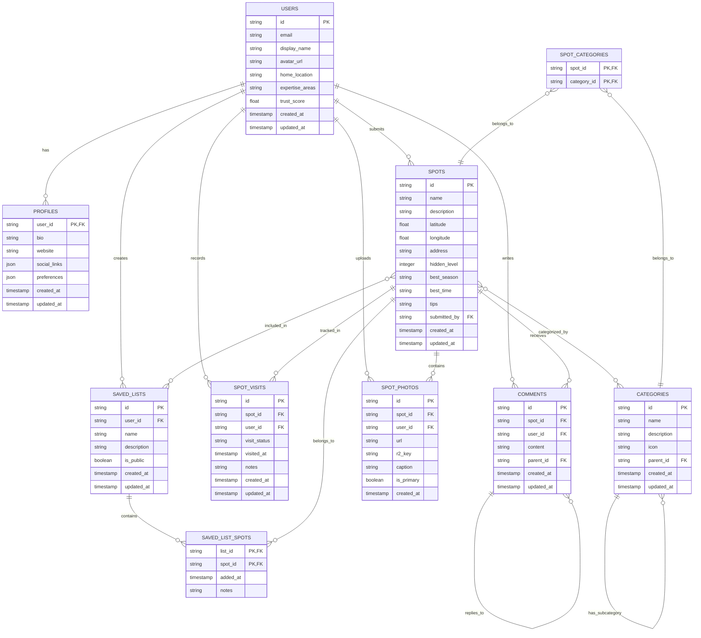

# マチポケ ER図（エンティティ関連図）

このドキュメントでは、マチポケアプリケーションのデータベースモデルのエンティティ関連図（ER図）を提供します。

## ER図

以下は、マチポケのデータベースモデルを表すER図です。この図は [Mermaid](https://mermaid-js.github.io/) 記法で記述されています。

## エンティティの説明

### ユーザー関連エンティティ

1. **USERS**
   - アプリケーションのユーザーアカウント情報を格納
   - 主要属性: ID、メールアドレス、表示名、信頼性スコア

2. **PROFILES**
   - ユーザーの詳細なプロフィール情報を格納
   - USERSとの1対1の関係

### コンテンツ関連エンティティ

3. **SPOTS**
   - 共有された場所の基本情報を格納
   - 位置情報（緯度・経度）、説明、特徴などを含む

4. **CATEGORIES**
   - スポットのカテゴリ情報を格納
   - 自己参照関係により階層構造（親-子カテゴリ）をサポート

5. **SPOT_PHOTOS**
   - スポットに関連付けられた写真情報を格納
   - 実際の画像データはR2ストレージに保存され、参照キーを保持

6. **COMMENTS**
   - スポットに対するコメントを格納
   - 自己参照関係によりネスト構造（返信）をサポート

### ユーザーアクション関連エンティティ

7. **SPOT_VISITS**
   - ユーザーによるスポットの訪問履歴または「行きたい」マークを管理
   - ユーザーとスポットの関係を追跡

8. **SAVED_LISTS**
   - ユーザーが作成したスポットのコレクション
   - プライベートまたは公開設定が可能

### 関連テーブル（中間テーブル）

9. **SPOT_CATEGORIES**
   - スポットとカテゴリ間の多対多関係を管理
   - 複合主キーを使用

10. **SAVED_LIST_SPOTS**
    - 保存リストとスポット間の多対多関係を管理
    - 追加日時やメモなどの属性を持つ

## 主要なリレーションシップ

1. **ユーザーとコンテンツの関係**:
   - ユーザーはスポットを投稿する (1対多)
   - ユーザーは写真をアップロードする (1対多)
   - ユーザーはコメントを書く (1対多)

2. **コンテンツ間の関係**:
   - スポットは複数のカテゴリに属する (多対多)
   - スポットは複数の写真を持つ (1対多)
   - スポットは複数のコメントを受け取る (1対多)
   - コメントは階層構造を持つ (自己参照)

3. **ユーザーアクション**:
   - ユーザーはスポットを訪問/訪問希望としてマークする (多対多)
   - ユーザーは保存リストを作成し、スポットを追加する (多対多)

## 設計上の特記事項

1. **複合主キーと外部キー**:
   - 中間テーブル（SPOT_CATEGORIES, SAVED_LIST_SPOTS）は複合主キーを使用
   - 参照整合性を維持するために外部キー制約を適用

2. **自己参照関係**:
   - CATEGORIES: 親子関係を表現するための自己参照
   - COMMENTS: ネストされたコメントのための自己参照

3. **地理情報データ**:
   - SPOTSテーブルは位置情報（緯度・経度）を格納
   - 地理的検索を高速化するためのインデックスを適用

4. **タイムスタンプフィールド**:
   - ほとんどのテーブルは作成日時と更新日時を追跡
   - 変更履歴とデータの鮮度を管理

## 注意事項

- このER図は論理データモデルを表現しており、実装時の物理的な制約やパフォーマンスの考慮事項によって、実際のスキーマは若干異なる場合があります。
- Cloudflare D1の制約により、特定のSQLite機能や拡張機能が使用できない場合があります。
